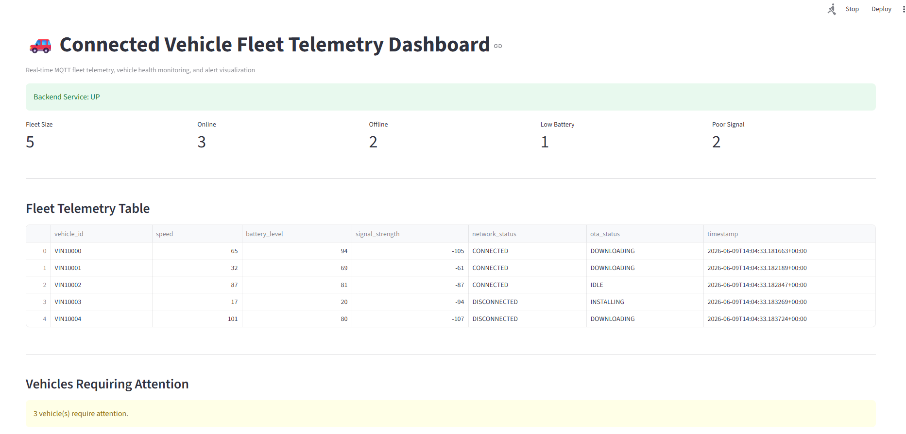

# Connected Vehicle Fleet Telemetry Dashboard



## Overview

A Connected Vehicle Fleet Telemetry Platform that simulates real-time vehicle telemetry using MQTT, processes telemetry through a FastAPI backend, evaluates vehicle health and alerts, and visualizes fleet operations through a Streamlit dashboard.

This project demonstrates concepts commonly used in:

- Connected Vehicle Systems
- Telematics Platforms
- OTA Monitoring
- Fleet Operations
- IoT Telemetry
- Systems Integration
- Vehicle Health Monitoring

---

## Technology Stack

- Python
- MQTT
- FastAPI
- Streamlit
- Pytest
- GitHub Actions
- REST APIs

---

## Features

- Multi-Vehicle Fleet Simulator
- MQTT Telemetry Publishing
- FastAPI Backend Services
- Fleet Health Monitoring
- Vehicle Health Scoring
- Alert Generation Engine
- OTA Status Monitoring
- Real-Time Dashboard
- Automated Testing with Pytest
- CI/CD with GitHub Actions
- Configurable Fleet Scenarios

---

## Project Architecture

Vehicle Simulator
→ MQTT Broker
→ FastAPI Backend
→ Alert Engine
→ Health Engine
→ REST APIs
→ Streamlit Dashboard

---

## Run Demo

```bash
run_demo.bat
```

## Stop Demo

```bash
stop_demo.bat
```

## Run Tests

```bash
run_tests.bat
```

---

## Sample Fleet Metrics

- Fleet Size
- Online Vehicles
- Offline Vehicles
- Low Battery Vehicles
- Poor Signal Vehicles
- OTA Campaign Status
- Vehicle Health Score

---

## CI/CD

GitHub Actions automatically:

- Installs dependencies
- Runs Pytest test suite
- Validates API functionality
- Verifies project health on every push

---

## Repository Purpose

This portfolio project was created to demonstrate practical skills relevant to:

- Connected Vehicle Integration Engineer
- OTA Integration Engineer
- Telematics Engineer
- Systems Integration Engineer
- Technical Program Manager (Connected Systems)
